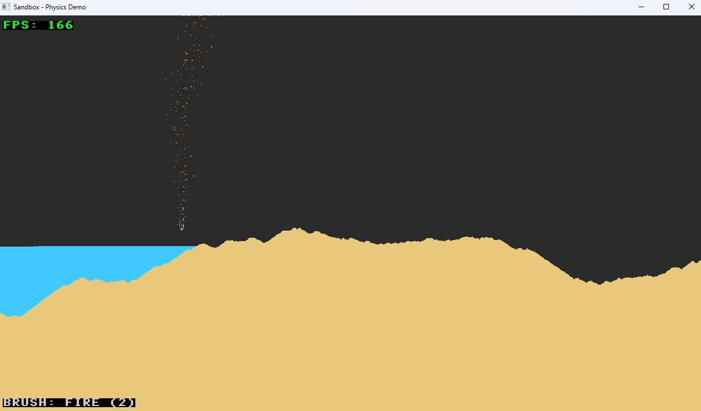
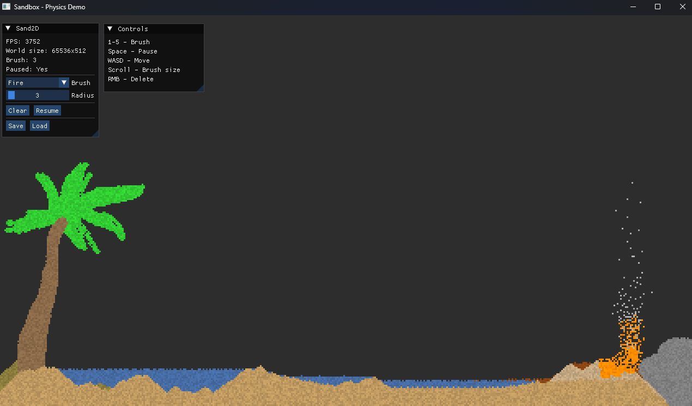
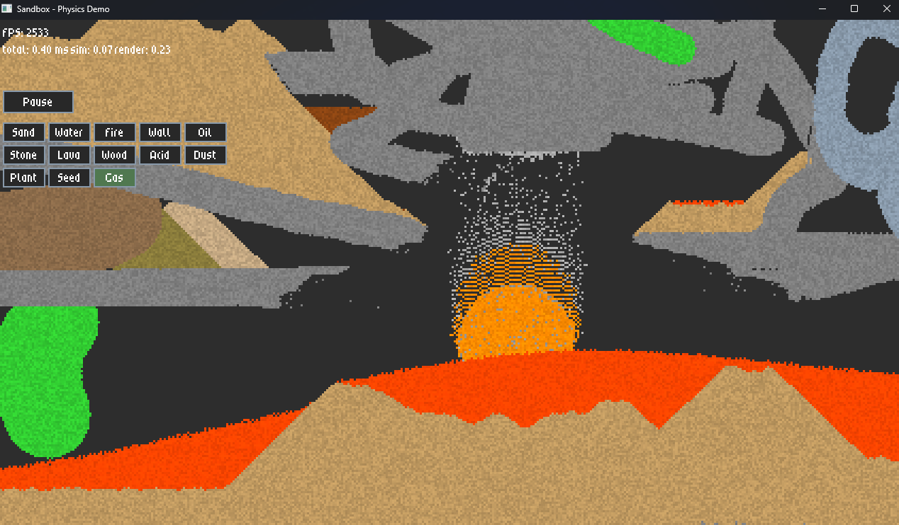

# Falling Sand Engine (SIMULATION)
<p align="center">
    <a href="https://isocpp.org/"></a>
    
</p>

A real-time 2D particle sandbox simulation with physics-based interactions. Features sand, water, and walls with realistic movement behaviors.

## Screenshots


*Preview (16/7/26)*


*Preview (2/9/26)*


*Preview (17/9/26)*

## TODO

### v0.2 — Performance (in progress)
- [ ] Multithreaded simulation
- [ ] Two-phase tick
- [ ] RNG optimization
- [ ] Direct cell access in renderer

### v0.3 — Physics
- [ ] Temperature field
- [ ] Reaction table
- [ ] Liquid pressure
- [ ] Phase transitions

### v0.4 — Tools
- [ ] Line/rect/fill tools
- [ ] Undo/redo
- [ ] Particle editor

### v0.5 — Scripting
- [ ] Lua bindings
- [ ] Demo scenes

### v1.0 — Release
- [ ] WASM port
- [ ] Documentation

# Build Guide

How to build **Falling Sand Engine** on Windows.

## Requirements

| Tool | Version | Notes |
|------|---------|-------|
| CMake | 3.24+ | Required for `CMakePresets.json` v6 |
| C++ compiler | C++20 | GCC 11+, Clang 14+, MSVC 19.30+ |
| Ninja | 1.10+ | Or any other CMake generator |
| vcpkg | latest | For dependency management |

Dependencies (installed automatically by vcpkg):
- SDL3
- SDL3_ttf
- LZ4

---

### 1. Install vcpkg

### 2. Build and run
### Windows
```powershell
cmake --preset release
cmake --build --preset release
build\debug\src\Sand2D.exe
```

## Controls

| Key | Action |
|-----|--------|
| `1` | Select Sand |
| `2` | Select Water |
| `3` | Select Fire |
| `4` | Select Wall |
| `5` | Select Oil |
| `LMB` | Place selected particle |
| `RMB` | Delete particle |
| `Mouse Wheel` | Adjust brush size |
| `Space` | Pause/Resume simulation |
| `ESC` | Exit |
