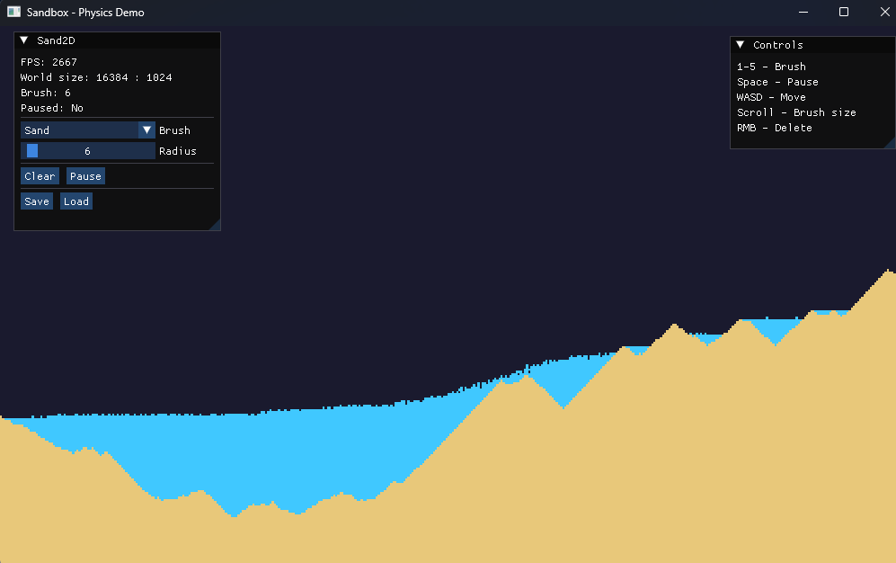

# Falling Sand Engine (SIMULATION)

A real-time 2D particle sandbox simulation with physics-based interactions. Features sand, water, and walls with realistic movement behaviors.

## Screenshots

## Build

### Prepare build files
cmake -B build -G "Visual Studio 18 2026"

### Run build
cd build/
cmake --build . --config Release

## TODO

- [x] Background color
- [ ] Particle velocity system (inertia, momentum)
- [x] Variable brush size
- [x] Pause simulation (Spacebar)
- [ ] Particle counter (total particles on screen)
- [x] FPS counter overlay

### Core Physics
- [ ] Surface tension for water
- [ ] State changes: Water → Steam, Sand → Glass
- [x] Density-based layering (oil floats on water)

### New Content
- [ ] Lava (melts walls, ignites wood)
- [ ] Wood (burns, creates ash)
- [x] Oil (floats on water, ignites)
- [ ] Acid (dissolves most materials)
- [ ] Plant/Seed (grows on soil)
- [x] New particles

### Advanced Physics
- [ ] Explosion physics (shockwave, debris)
- [ ] Wind simulation (directional airflow)

### Visual & UI
- [x] Camera
- [ ] Particle picker UI (click to select material)
- [ ] Particle info tooltip (hover for details)
- [ ] Grid overlay toggle
- [x] Save/load worlds

### Gameplay
- [ ] Sandbox tools (fill, clear, copy/paste)
- [ ] Undo/Redo system
- [ ] Recording/Replay of simulations

### Performance & Polish
- [ ] Multithreaded physics (parallel particle updates)
- [ ] GPU acceleration (OpenCL/CUDA for physics)
- [ ] WebAssembly port (Emscripten)
- [ ] Save to IndexedDB (web persistence)

### Long-term
- [ ] Multiplayer (real-time sharing)
- [ ] Modding API (custom particles, behaviors)
- [ ] Mobile support (touch controls)

## Controls

| Key | Action |
|-----|--------|
| `1` | Select Sand |
| `2` | Select Water |
| `3` | Select Fire |
| `4` | Select Wall |
| `5` | Select Oil |
| `LMB` | Place selected particle |
| `RMB` | Delete particle |
| `Mouse Wheel` | Adjust brush size |
| `Space` | Pause/Resume simulation |
| `ESC` | Exit |
